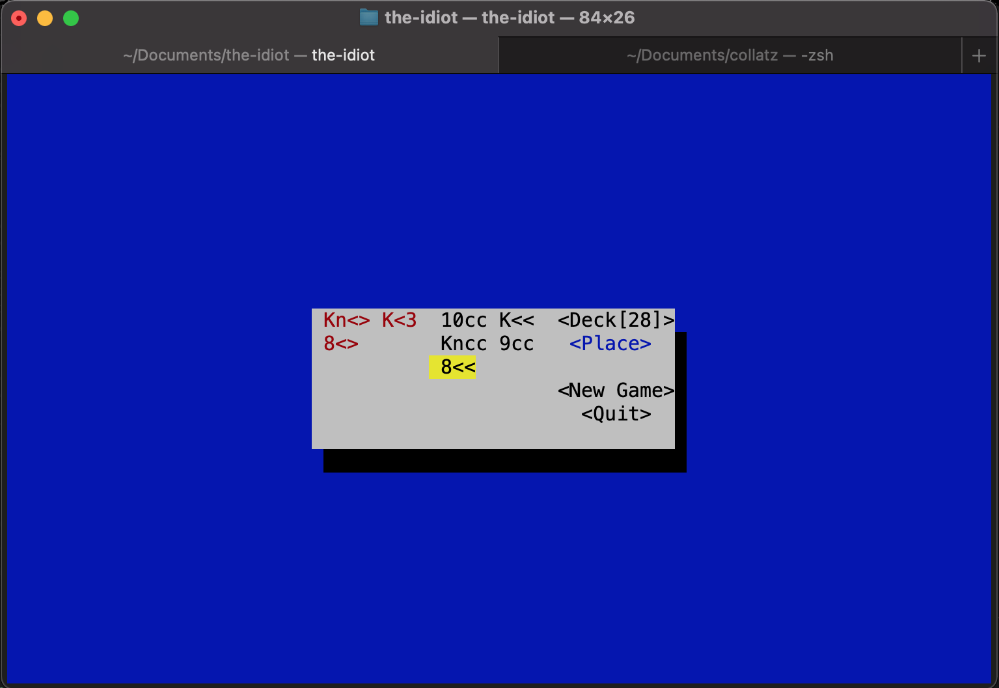

# The Idiot

*The Idiot* is a solitaire named after the fact that you have to be an idiot to try to solve it! The
name also stems from the simple rules.

## Installation

Run the command `cargo run` and play the game in the terminal!

## Rules and how to play

The goal of *The Idiot* is to end up only having the four kings of each suit on the table. Clicking
the **Deck** button (or selecting it and hitting *Enter*)  will draw four cards from the deck and
put one in each row.

If the bottom card in two rows have the same suit the lesser of them should be removed. Do this by
selecting the card and hit *Enter*. King is the highest rank so Aces are low.

If a row is empty it is possible to move the bottom card from any row containing two or more cards 
to the empty one. This is done by first clicking **Place**, then the row to move a card from and 
then the empty row.

Good luck! You will need it...

### About the symbols for the suits

The library used to render the UI ([*cursive*](https://github.com/gyscos/cursive)) supports Unicode 
characters but the render is clunky. So it is not currently possible to have pretty symbols for the
suits. Instead a not so nice to look at ASCII replacement is in place: 
* ♠️ : <<
* ♥️ : <3
* ♣️ : cc
* ♦️ : <>
